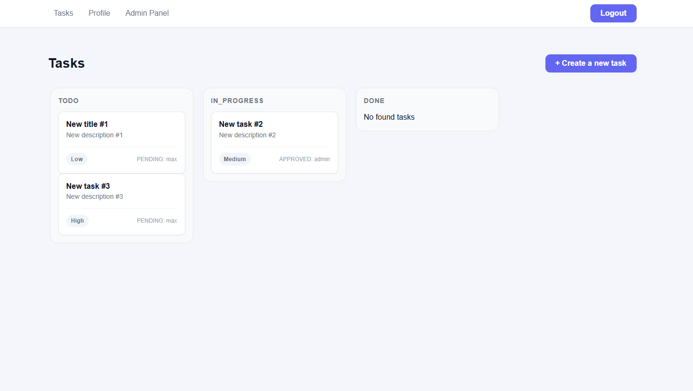

# Task Board

Full-stack task management application built.



## Overview

Task Board is a Trello-like task management SPA with Kanban board, drag & drop,
user assignments, admin panel, and JWT-based authentication.

## Tech Stack

- **React 18** with TypeScript
- **Vite** — build tool
- **TanStack Query** — server state and caching
- **Zustand** — client state management
- **React Router v7** — routing
- **React Hook Form + Zod** — form validation
- **dnd-kit** — drag & drop
- **SCSS Modules** — styling

## Architecture

Frontend follows Feature-Sliced Design (FSD):

- app — app initialization, providers, routing
- pages — route-level pages
- widgets — large UI blocks
- features — business features
- entities — domain entities
- shared — reusable infrastructure and UI

## Features

- Login / Registration with JWT
- Task CRUD (create, read, update, delete)
- Kanban board with drag & drop between statuses
- Task assignment with approve / reject flow
- Admin panel: user management (ban / unban) and task controls
- Profile page with password change
- Protected routes with role-based access
- Optimistic updates for instant UI feedback

## Prerequisites

- Node.js 20+

## Setup

```bash
git clone --recursive https://github.com/RuMax21/task-board.git
cd task-board

cd backend
npm install
cp .env.example .env
npx prisma generate
npx prisma migrate deploy
npx prisma db seed
npm run start:dev
cd ..

cd frontend
npm install
```

## Environment Variables

### Frontend (frontend/.env)

```bash
VITE_API_URL=http://localhost:3000
```

## Run

```bash
cd backend
npm run start:dev

cd frontend
npm run dev
```

## URLs

- Frontend: http://localhost:5173
- Backend: http://localhost:3000
- Swagger: http://localhost:3000/docs

## Seeded accounts

| Nickname | Password    | Role  | Email (optional, for future mail) |
| -------- | ----------- | ----- | --------------------------------- |
| admin    | password123 | ADMIN | admin@example.com                 |
| user     | password123 | USER  | user@example.com                  |
